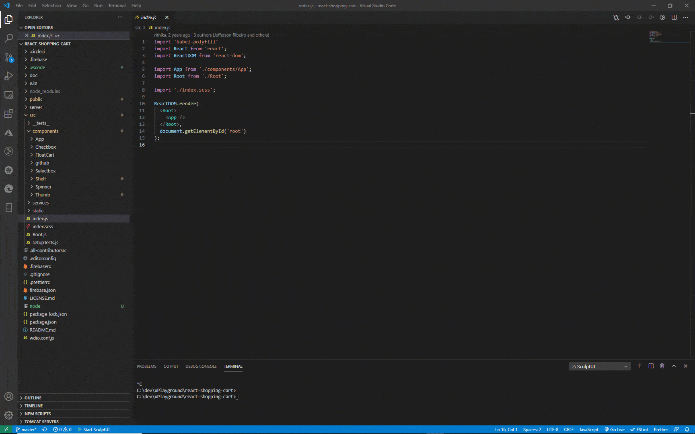
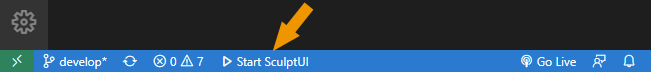

# SculptUI - VS Code Extension

_"Sculpt your front-end code visually"_

This VS Code extension integrates a visual runtime UI builder seamlessly into your existing code editing
experience.

Style your React elements in the running web application and let sculpt
write the code for you. Or move an element using drag & drop in the browser
to change the structure of your component's elements. Or just add or change the property
of a React element inside your browser, and it will update the code.

And when you want to edit something in the source code yourself, click the "Select in IDE" button
inside the Sculpt editor to bring VS Code right to the relevant spot in your code.

This is only the beginning of a revolutionary, more efficient, more natural way of building
web applications. Sculpt the future of front-end development with us.

<!-- TODO: Gif showing selection of element. -->

## Features

### Find relevant code in VS Code

Run your application, select any component during runtime and click on  (select code) button in the browser. The source code where the element is defined will be selected inside your [VS Code](https://code.visualstudio.com/) editor.

You can also use the  "Select code in IDE" button in many other places of Sculpt's editor to jump directly to the appropriate code (i.e. css, styled component definition, JSX attribute).

### Style components using editor in browser

Use SculptUI's powerful styles editor to view and change style attributes defined in plain (s)css, (s)css modules, [styled-components](https://styled-components.com/) or [Material-UI Styles](https://material-ui.com/styles/basics/). See the results in your UI while the code is written for you.

### Move elements in your component

Use drag & drop to visually move elements in your component's tree and let sculpt handle changing your JSX code.

### View and edit properties in browser

In the embedded property editor you see all the properties defined on the selected element. And you can edit them right there and watch your changes reflect in the browser and your code.

### More to come

We are working hard on more features for you to look forward to:

- Full WYSWYG component editing - like inserting and moving around components using drag-and-drop, extracting component parts to a new component
- Configurable integrated component galleries, style guides, and design systems
- Even more styling options
- Pluggable custom property editors for component libraries
- Support for other UI frameworks and libraries (i.e. [Angular](https://angular.io/), [Vue](https://vuejs.org/), Web Components and more)

So stay tuned!

## Getting started

- `Install this extension in your VS Code` 
  Install the extension by clicking on the Extensions icon in the Activity Bar on the side of VS Code, searching for "SculptUI" and then pressing the "Install" button.

- `Press the "Start SculptUI" button in the status bar` 
  When you have a folder open containing a CRA or NextJs project just use the "Start SculptUI" button shown at the bottom in the status bar of VS Code. Your web application is compiled, dev server started and the browser opened running your app.
  

- `Click on an element in the browser` 
  Now you can enjoy the magic, just click on any component in the runtime web application in the browser to select it.
  Jump to the matching code focused right inside your VSCode editor using the  button, move the element using drag & drop or just _sculpt_ the styles and properties of your element in the panels embedded next to your running app.

## Custom Setup

If you are using custom scripts or a custom server with NextJs check out [Custom Setup](docs/custom-setup.md)

## Status

At the moment this is experimental and only React components are supported on projects based on [Create React App](https://create-react-app.dev/) (unejected or using [react-app-rewired](https://github.com/timarney/react-app-rewired) or [craco](https://github.com/gsoft-inc/craco/)) or [Next.js](https://nextjs.org/). But keep updated because we're fixing and extending fast. Please help us make this perfect for the way you work by sending us your feedbacks, issues and feature requests to our [issues list](https://github.com/sculptui/vscode/issues).

## Requirements

- Visual Studio Code Version 1.35 and higher
- Project using:
  - [react-scripts](https://github.com/facebook/create-react-app/tree/master/packages/react-scripts) (version 2.0 and above) from [Create React App](https://github.com/facebook/create-react-app/)
  - config overrides with [react-app-rewired](https://github.com/timarney/react-app-rewired) or [craco](https://github.com/gsoft-inc/craco/)
  - [Next.js](https://nextjs.org/)
- doesn't work (yet) when react-scripts has been ejected

## Extension Settings

The following can be optionally configured in the extensions settings:

- `sculpt-ui.folderForStarting`: Set a specific sub folder to start sculpt in. This folder should be configured to your React client application if this is not in your root folder. Use relative path (i.e. 'client').
- `sculpt-ui.port`: Override the port(s) sculpt server listens on. If nothing set the usual port for the development server (normally 3000) is used. Format can be either '9999' for a single port or '9000-9099' for a port range where the first available port is retrieved.
- `sculpt-ui.https`: Set to run the sculpt server in https mode. Only needed if the default configuration needs to be explicitly overriden.

---

## Troubleshooting

### SculptUI not showing in the status bar

- Are the required npm modules (i.e. react-scripts or next) in the ./node_modules folder. Have you run "npm install" or "yarn install" already?

- On activation SculptUI will check for [react-scripts](https://github.com/facebook/create-react-app/tree/master/packages/react-scripts) and the required version (see [Requirements](#requirements)) or [Next.js](https://nextjs.org/). If one of the requirements are not matched the SculptUI status bar will not be shown. You could try running SculptUI using the extensions commands (press Ctrl/Cmd + Shift + P to display the editor’s command palette, and then type SculptUI to see the list of the available commands). But most probably the requirements are not met and SculptUI can not be used on your project.

### Possible errors when running

- _Building in wrong folder_: By default SculptUI will start the web application in the root folder if it contains react-scripts. Otherwise all subfolders downto 3 levels are checked. If multiple folders match requirements, you should be able to pick which one. You can also set the subfolder you want in the extension setting "sculpt-ui.folderForStarting" (see [Extension Settings](#extension-settings)) of your workspace.

- _Application requires specific port_: Sometimes applications, API or firewalls are configured to only work on a specific port. You can change the port used by SculptUI (by default 3000) to what you need in the [Extension Settings](#extension-settings).

- _Still not compiling_: Check the terminal window "SculptUI", where you will usually find any compilation or other errors. Also make sure your app builds correctly without SculptUI (running "npm start" or "yarn start" in the terminal).

## Issues & Feature Requests

If you have any feedbacks, issues or feature requests please post them on our [issues list](https://github.com/sculptui/vscode/issues).

---

## Release Notes

Checkout all changes in the [change log](CHANGELOG.md).

---

**Enjoy!**
