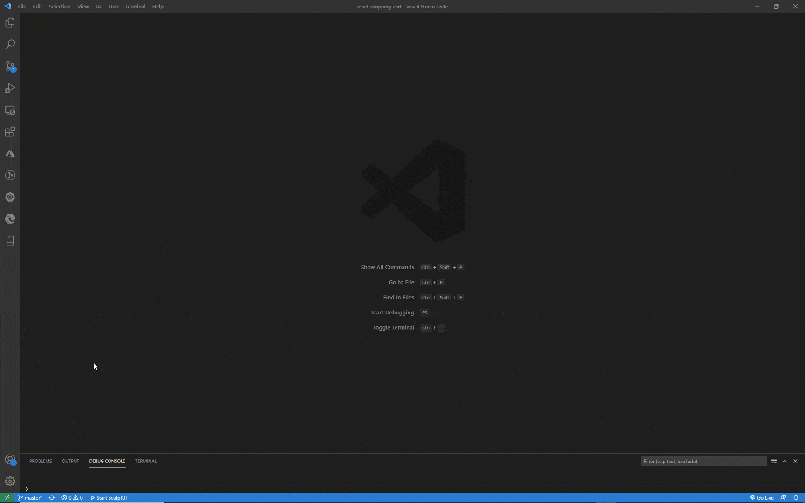

# SculptUI - VS Code Extension

_"Sculpt your UI code visually"_

This VS Code extension integrates a visual UI builder seamlessly into your code editing
experience.

Style your React elements in the application running in your browser and let sculpt
write the code for you. And when you need to edit something in your code, just click the element
and jump right to the relevant spot in your VSCode editor.

This is only the beginning of a revolutionary, more efficient, more natural way of building
frontend code. Sculpt the future of frontend development with us.

## Features

Run your application and select any component to jump right into the code section where it is defined inside your [VS Code](https://code.visualstudio.com/) editor.

<!-- TODO: Gif showing selection of element. -->

Use SculptUI's styles editor to change inline style attributes or select (or even create) style class names from sass, scss and less (modules) files and edit the styles there. See the results in your UI while the code is written for you.

### More to come

This is just the start. We are working hard on more features which you can look forward to:

- Even more styling options (supporting [styled-components](https://styled-components.com/), [Material-UI styles](https://material-ui.com/styles/basics/), etc.)
- Full WYSWYG component editing - like inserting and moving around components using drag-and-drop, extracting component parts to a new component
- Generic and pluggable custom property editors for component libraries
- Configurable integrated component galleries, style guides and design systems
- Support for other UI frameworks and libraries (i.e. [Angular](https://angular.io/), [Vue](https://vuejs.org/), Web Components and more)

## Getting started

- `Install this extension in your VS Code` 
  Install the extension by clicking on the Extensions icon in the Activity Bar on the side of VS Code, searching for "SculptUI" and then pressing the "Install" button.

- `Press the "Start SculptUI" button in the status bar` 
  When you have a folder open containing a CRA or NextJs project just use the "Start SculptUI" button shown at the bottom in the status bar of VS Code. Your web application is compiled, dev server started and the browser opened running your app.

- `Click element in the browser to jump to code line` 
  Now you can enjoy the magic, just click on any component in the browser to select the matching code right inside your VSCode editor.

## Custom Setup

If you are using custom scripts or a custom server with NextJs check out [Custom Setup](docs/custom-setup.md)

## Status

At the moment this is experimental and only React components are supported on projects based on [Create React App](https://create-react-app.dev/) (unejected or using [react-app-rewired](https://github.com/timarney/react-app-rewired) or [craco](https://github.com/gsoft-inc/craco/)) or [Next.js](https://nextjs.org/). But keep updated because we're fixing and extending fast. Please help us make this perfect for the way you work by sending us your feedbacks, issues and feature requests to our [issues list](https://github.com/sculptui/vscode/issues).

## Requirements

- Visual Studio Code Version 1.35 and higher
- Project using:
  - [react-scripts](https://github.com/facebook/create-react-app/tree/master/packages/react-scripts) (version 2.0 and above) from [Create React App](https://github.com/facebook/create-react-app/)
  - config overrides with [react-app-rewired](https://github.com/timarney/react-app-rewired) or [craco](https://github.com/gsoft-inc/craco/)
  - [Next.js](https://nextjs.org/)
- doesn't work when react-scripts has been ejected

## Extension Settings

The following can be configured in the extensions settings:

- `sculpt-ui.folderForStarting`: Set a specific sub folder to start sculpt in. This folder should be configured to your React client application if this is not in your root folder. Use relative path (i.e. 'client').
- `sculpt-ui.port`: Override the port(s) sculpt server listens on. If nothing set the usual port for the development server (normally 3000) is used. Format can be either '9999' for a single port or '9000-9099' for a port range where the first available port is retrieved.
- `sculpt-ui.https`: Set to run the sculpt server in https mode. Only needed if the default configuration needs to be explicitly overriden.

---

## Troubleshooting

### SculptUI not showing in the status bar

- Are the required npm modules (i.e. react-scripts or next) in the ./node_modules folder. Have you run "npm install" or "yarn install" already?

- On activation SculptUI will check for [react-scripts](https://github.com/facebook/create-react-app/tree/master/packages/react-scripts) and the required version (see [Requirements](#requirements)) or [Next.js](https://nextjs.org/). If one of the requirements are not matched the SculptUI status bar will not be shown. You could try running SculptUI using the extensions commands (press Ctrl/Cmd + Shift + P to display the editor’s command palette, and then type SculptUI to see the list of the available commands). But most probably the requirements are not met and SculptUI can not be used on your project.

### Possible errors when running

- _Building in wrong folder_: By default SculptUI will start the web application in the root folder if it contains react-scripts. Otherwise all subfolders downto 3 levels are checked. If multiple folders match requirements, you should be able to pick which one. You can also set the subfolder you want in the extension setting "sculpt-ui.folderForStarting" (see [Extension Settings](#extension-settings)) of your workspace.

- _Application requires specific port_: Sometimes applications, API or firewalls are configured to only work on a specific port. You can change the port used by SculptUI (by default 3000) to what you need in the [Extension Settings](#extension-settings).

- _Still not compiling_: Check the terminal window "SculptUI", where you will usually find any compilation or other errors. Also make sure your app builds correctly without SculptUI (running "npm start" or "yarn start" in the terminal).

## Issues & Feature Requests

If you have any feedbacks, issues or feature requests please post them on our [issues list](https://github.com/sculptui/vscode/issues).

---

## Release Notes

Checkout all changes in the [change log](CHANGELOG.md).

---

**Enjoy!**
